# LED Ring State Flow – pimonitor

This document describes the current LED state machine for the Kano hat ring
and how it responds to service status and button presses. It is meant as a
reference for both of us when reasoning about behaviour or making changes.

---

## 1. Service State Evaluation & Data Flow

### Service Check Cycle Flow

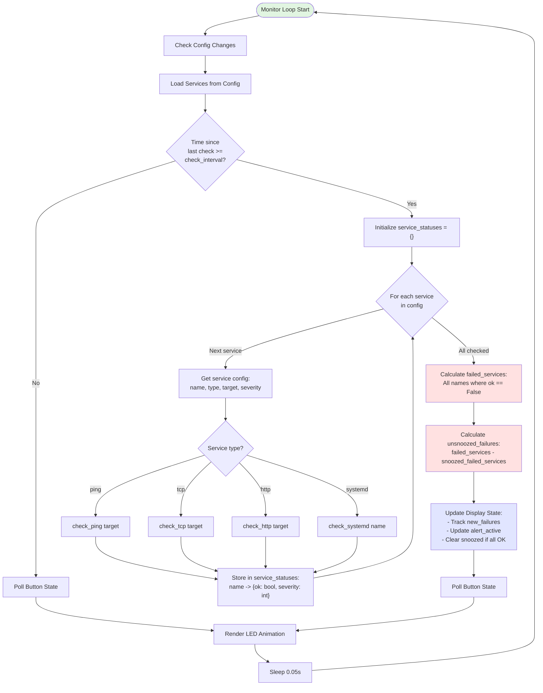

### State Variable Derivation

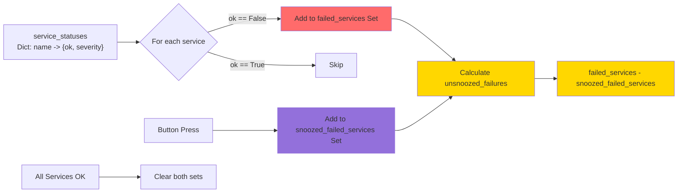

---

## 2. LED State Decision Tree & Rendering

### Complete State Decision Tree

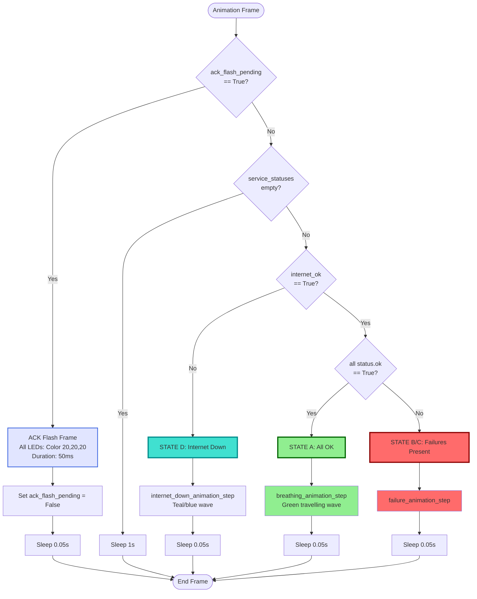

### State A: All OK - Green Wave Animation

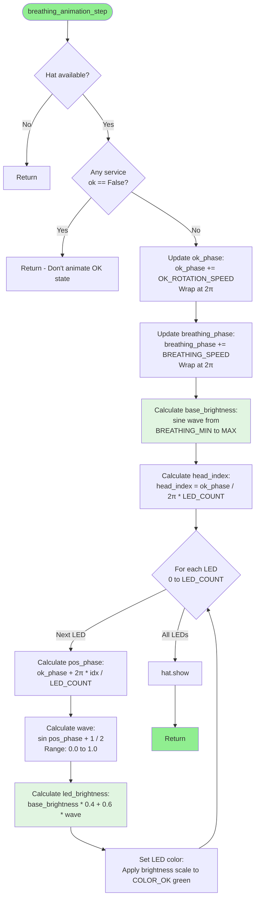

### State B/C: Failure Animation - Detailed Rendering Flow

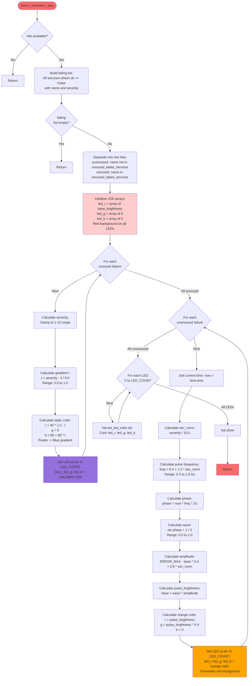

### State Summary Table

| State | Condition | LED Pattern | Button Effect |
|-------|-----------|-------------|---------------|
| **State A** | `failed_services == ∅` `internet_ok == True` | Green travelling wave with breathing | ACK blink only |
| **State B** | `failed_services ≠ ∅` `unsnoozed_failures ≠ ∅` `internet_ok == True` | Red background + pulsing orange (unsnoozed) + static purple/blue (snoozed) | Snooze all failures → State C |
| **State C** | `failed_services ≠ ∅` `unsnoozed_failures == ∅` `internet_ok == True` | Red background + static purple/blue only | ACK blink only |
| **State D** | `internet_ok == False` | Dark blue/cyan base with occasional soft cyan/magenta/purple “glitch” sparkles | ACK blink only (does not snooze internet-down) |
| **ACK Overlay** | `ack_flash_pending == True` | All LEDs: dim white (20,20,20) for 50ms | N/A (one frame only) |

---

## 3. State Machine & Transitions

### Complete State Machine Diagram

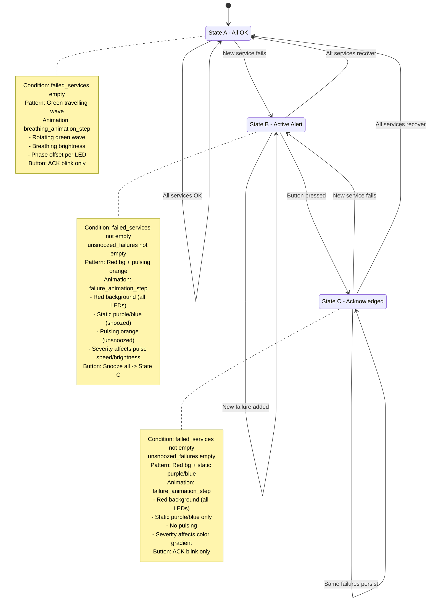

### State Transition Decision Tree

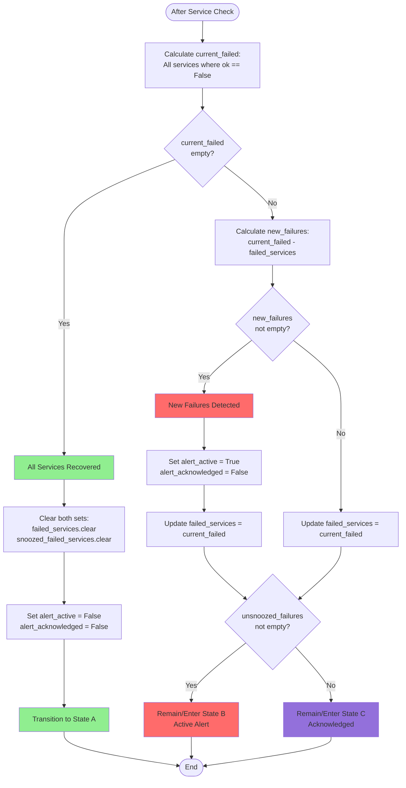

### Button Press Handling Flow

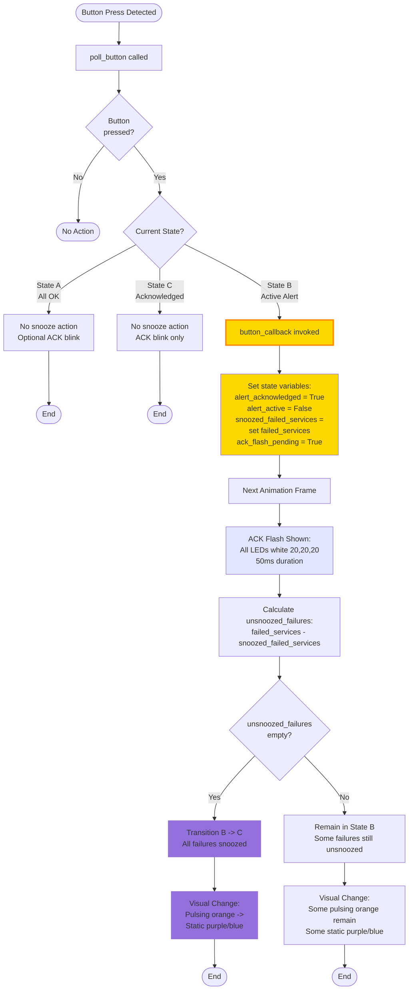

### Transition Summary Table

| Transition | Trigger | State Changes | Visual Effect |
|------------|---------|---------------|---------------|
| **A → B** | New service fails | `failed_services` grows `unsnoozed_failures` grows `alert_active = True` | Green wave → Red bg + pulsing orange |
| **B → C** | Button pressed | `snoozed_failed_services = failed_services` `unsnoozed_failures = ∅` `ack_flash_pending = True` | Pulsing orange → Static purple/blue |
| **C → B** | New service fails (not snoozed) | `failed_services` grows `unsnoozed_failures` grows | Static purple/blue → Add pulsing orange |
| **B/C → A** | All services recover | `failed_services.clear()` `snoozed_failed_services.clear()` `alert_active = False` | Red bg → Green wave |

---

## 4. LED Mapping & Debugging

### LED Assignment Logic

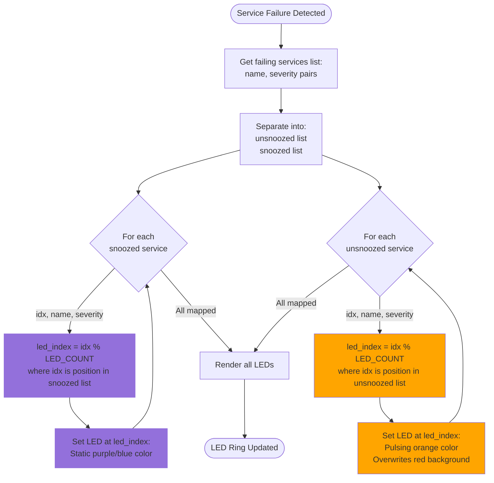

### Single Service Failure - Before & After Snooze

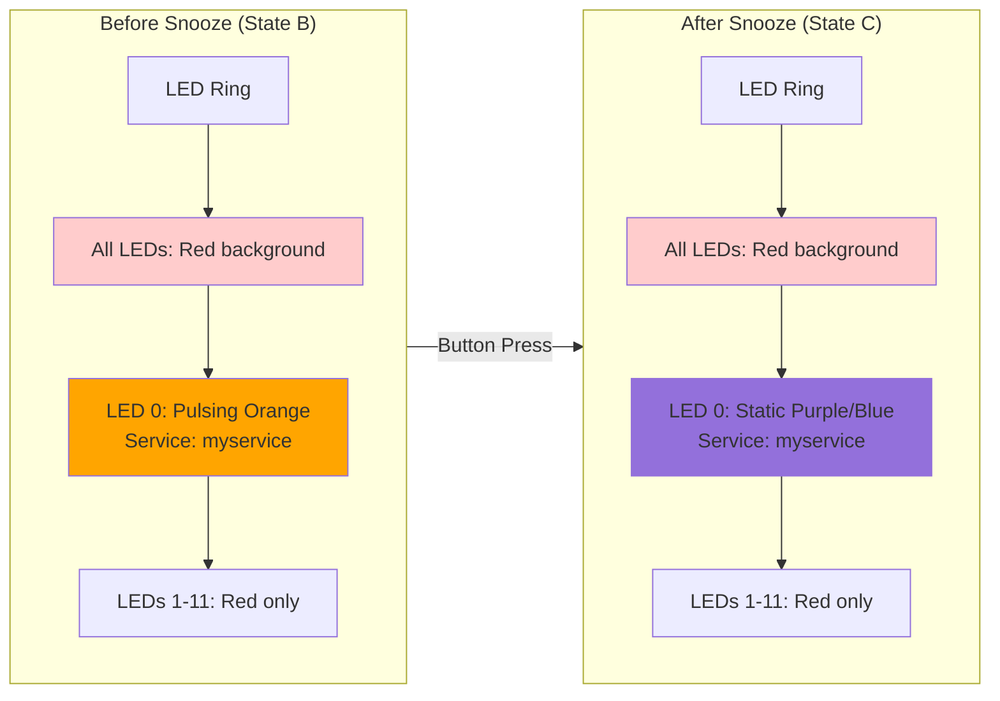

### Multiple Service Failures - LED Sharing

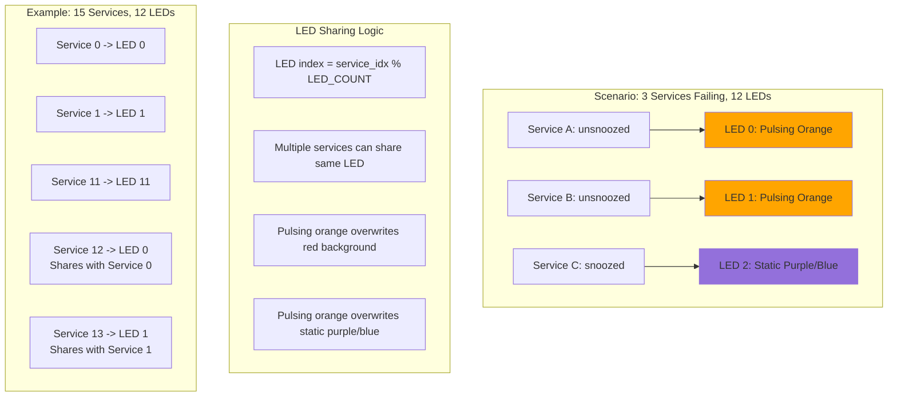

### Debugging: Why Two LEDs Appear

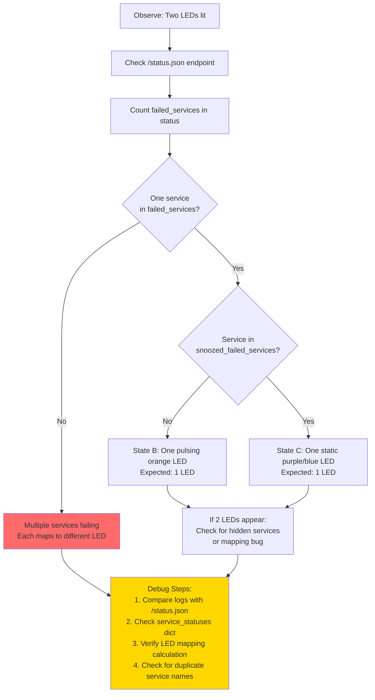

---

This document reflects the current code paths in `pimonitor/monitor.py` after
removing `led_position` and moving to the wave + per‑service pulse model. It
should be updated whenever the state machine or colour semantics change.
